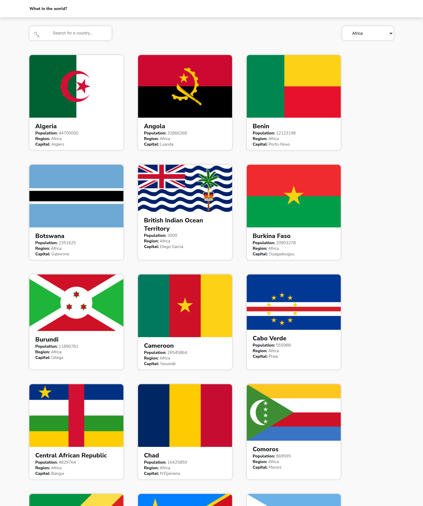

# World countries app

## Table of contents

- [Overview](#overview)
  - [Screenshot](#screenshot)
  - [Links](#links)
- [My process](#my-process)
  - [Built with](#built-with)
  - [Continued development](#continued-development)
  - [Useful resources](#useful-resources)
- [Acknowledgments](#acknowledgments)

## Overview

### Screenshot

### Links

- [Code URL](https://github.com/iLebo-stack/rest-countries)
- [Live site](https://ilebo-stack.github.io/rest-countries/)

## My process

### Built with

- Semantic HTML5 markup
- SCSS
- Flexbox
- CSS Grid
- Mobile-first workflow
- [React](https://reactjs.org/) - JS library
- Fetch API

### Continued development

In this project and future projects I want to focus on improving user experience.

### Useful resources

- [Rest countries](https://restcountries.com/#rest-countries) - This helped me in acquiring data about countries to build this app.
- [Mate academy](https://mate.academy/) - When I joined mate academy my coding skills improved greatly.
- [Frontendmentor](https://www.frontendmentor.io/challenges/rest-countries-api-with-color-theme-switcher-5cacc469fec04111f7b848ca) - This is a challenge from frontendmentor.

## Acknowledgments

Thanks to frontendmentor for making this challenge free.
